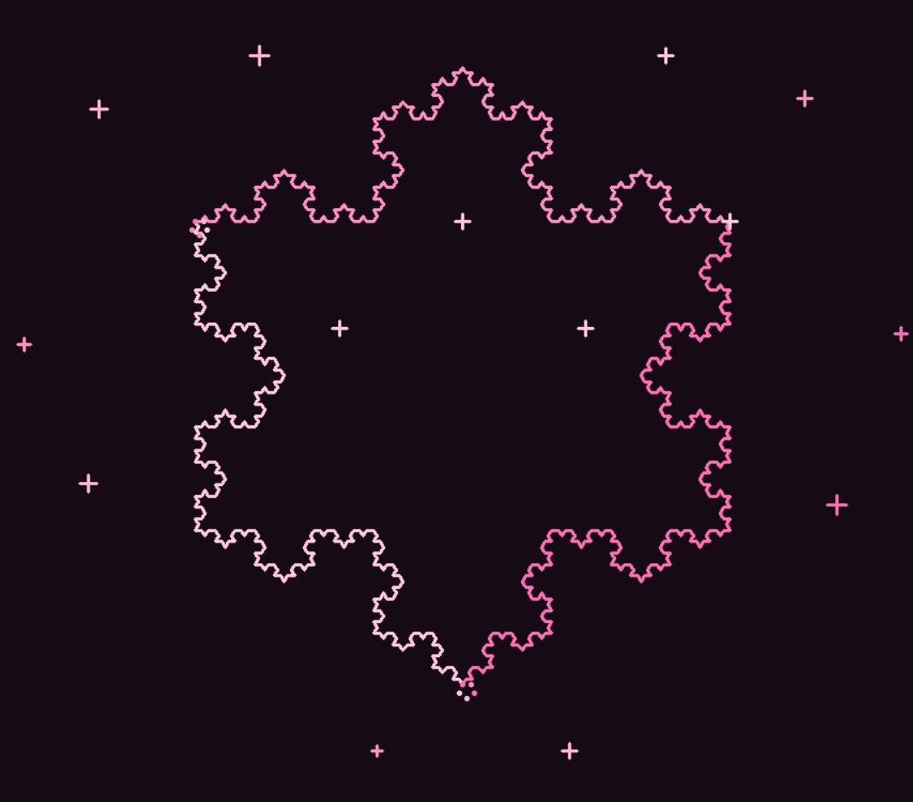
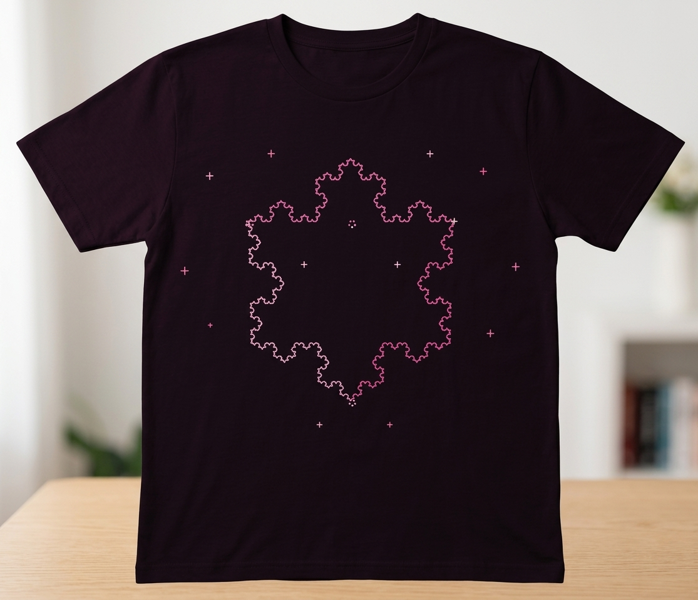

# ♡ Pink Dream Koch Snowflake ♡

## Project Description

**Pink Dream Koch Snowflake** is a creative fractal visualization made using Python and the Turtle graphics library. The project generates a Koch Snowflake using recursive subdivision and adds a cute pink visual theme with decorative flowers, sparkles, and a dark background.

The project demonstrates important fractal concepts such as **recursion, self-similarity, iteration, and geometric patterns** while combining them with creative visual design.

---

## Fractal Type

**Koch Snowflake**

The Koch Snowflake is a fractal created by repeatedly replacing each line segment with a pattern of four smaller segments. Each new segment is processed recursively, creating increasingly detailed and self-similar edges.

In this project, the Koch curve is generated using a recursive function with a recursion depth of **4**.

---

## Features

*  Recursive Koch Snowflake generation
*  Multiple shades of pink
*  Decorative sparkles
*  Small flower-like decorations
*  Dark background for contrast
*  Three-sided symmetrical fractal structure
*  Recursive subdivision of line segments
*  Creative visual composition using Python Turtle

---

## Technologies Used

* **Python 3**
* **Turtle Graphics**
* **Random module**
* **Math module**

No external libraries are required.

---

## How It Works

The main fractal is generated using the recursive function:

```python
def koch_curve(t, length, depth):
```

The function divides each line into four smaller sections.

When the recursion depth reaches zero, the program draws a straight line:

```python
if depth == 0:
    t.pendown()
    t.forward(length)
    t.penup()
    return
```

Otherwise, the function calls itself repeatedly with a smaller line length and a reduced depth.

This process creates the self-similar structure of the Koch Snowflake.

The program also uses Turtle's drawing functions to add decorative flowers and sparkles around the fractal.

---

## Requirements

You need:

* Python 3.x
* VS Code or another Python-compatible editor

The Turtle library is included with standard Python installations, so no additional package installation is required.

---

## How to Run

### 1. Clone or download the repository

Download the project from GitHub.

### 2. Open the project folder

Open the folder in VS Code.

### 3. Open the terminal

In VS Code, select:

**Terminal → New Terminal**

### 4. Run the program

Use:

```bash
python Lab-01.py
```

A new window will open displaying the Pink Dream Koch Snowflake.

---

## Output

The program produces a symmetrical pink Koch Snowflake on a dark background with decorative flowers and sparkles.

---

## Concepts Demonstrated

### Recursion

The `koch_curve()` function calls itself with a smaller length and a lower recursion depth.

### Self-Similarity

Each section of the snowflake contains the same basic pattern at a smaller scale, which is a defining characteristic of fractals.

### Iteration

Loops are used to draw the three sides of the snowflake and generate the decorative elements.

### Mathematical Geometry

The snowflake uses angles of **60°, 120°, and 120°** to create the triangular structure.

---

## Creative Design

The project goes beyond a basic Koch Snowflake by using:

* A dark pink background
* A custom pink color palette
* Different colors for the three sides
* Decorative flowers
* Four-point sparkles
* Randomized decorative colors and sizes

These design choices turn a mathematical fractal into a more visually expressive composition.

---

## Student Information

**Name:** Fatima Haroon
**Registration Number:** 577112

**Course:** BS Computer Science
**Lab:** Fractal Visualization Lab

## Output 


## Shirt Design


